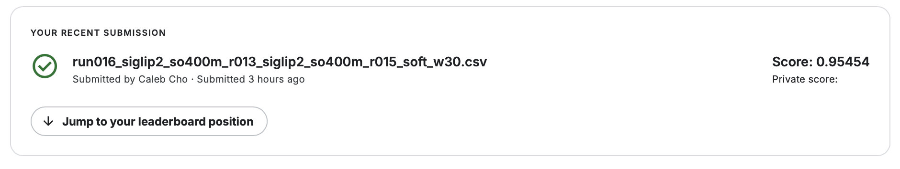

# CSE 144 Final Project: Kaggle Transfer Learning Challenge

100-class image classification using transfer learning for the UCSC CSE 144
Spring 2026 Kaggle competition.

## Start Here

Teacher-facing deliverables are organized in `submission/`:

| Item | Location |
|---|---|
| Final report source | `submission/final_report.md` |
| Final report PDF | `submission/final_report.pdf` |
| Kaggle submission CSV | `submission/submission.csv` |
| Source code | `src/` |
| Model/training config | `config.yaml` |
| Dependencies | `requirements.txt` |
| Weights link | `weights/README.md` |
| Leaderboard screenshot | `assets/kaggle_leaderboard.png` |

The final report PDF, model-weights link, and Kaggle screenshot are included or
referenced in this repository.

## Required External Links

- Kaggle competition:
  https://www.kaggle.com/competitions/ucsc-cse-144-spring-2026-final-project
- Trained model weights:
  https://drive.google.com/drive/folders/1B2p5ubG2Yc7x4FiWw4xVz9-ZXNZAlHzD?usp=share_link

## Results

| Model | Validation / Kaggle result |
|---|---:|
| ConvNeXt-S | 0.7720 reported OOF; 0.8000 Kaggle public accuracy |
| ConvNeXt-B | 0.7961 OOF accuracy |
| ConvNeXt-S + ConvNeXt-B equal OOF ensemble | 0.7924 OOF accuracy |
| Final team Kaggle submission | 0.95454 public score |

Best offline model: ConvNeXt-B.  
Best confirmed team Kaggle public score: 0.95454.

Leaderboard screenshot:



## Repository Layout

```text
src/
  data.py           # label mapping, datasets, transforms, folds
  model.py          # timm model factory, EMA, layer-wise LR decay
  train.py          # fine-tuning and OOF checkpoint generation
  predict.py        # inference and validated submission.csv writing
  oof_ensemble.py   # OOF ensemble analysis
  rebuild_oof.py    # rebuild OOF from checkpoints
  utils.py          # config, logging, seeding, validation helpers

submission/
  README.md
  final_report.md
  final_report.pdf
  submission.csv
  project_instructions.md

reports/
  final_report.md
  CSE144_Final_Report.md
  CSE144_Approach_Presentation.md

weights/
  README.md         # Google Drive checkpoint link goes here

assets/
  README.md
  kaggle_leaderboard.png

archive/
  development_notes/
  old_outputs/
```

## Setup

```bash
pip install -r requirements.txt
```

Pinned local versions:

- Python 3.11.5
- torch 2.1.2
- torchvision 0.16.2
- timm 1.0.27

The code selects `cuda`, then `mps`, then `cpu`. AMP is enabled on CUDA only.

## Train

Train the best offline model, ConvNeXt-B:

```bash
PYTORCH_ENABLE_MPS_FALLBACK=1 python src/train.py \
  --backbone convnext_base \
  --device mps \
  --batch-size 8 \
  --out checkpoints_local
```

Train the ConvNeXt-S baseline:

```bash
python src/train.py --backbone convnext_small --out checkpoints_local
```

## Validate OOF Results

```bash
python src/oof_ensemble.py \
  --ckpt-dir checkpoints_local \
  --backbones convnext_small,convnext_base
```

Expected recorded output:

```text
convnext_small: acc=0.7785
convnext_base: acc=0.7961
ensemble_equal: acc=0.7924
```

## Inference

Generate a full Kaggle CSV for all 1,036 test images:

```bash
python src/predict.py \
  --ckpt-dir checkpoints_local \
  --backbones convnext_base \
  --out submission/submission.csv
```

The inference script validates row count, ID order, column names, and label range
before writing the CSV.

## Data Notes

The verified dataset contains 1,079 train images across 100 classes, with class
counts ranging from 4 to 41 images. The test directory contains 1,036 images.

The folder name is the label: `Data/train/7/...` maps to label `7`. The code uses
an explicit `int(folder_name)` mapping and asserts labels are exactly `0..99`.
